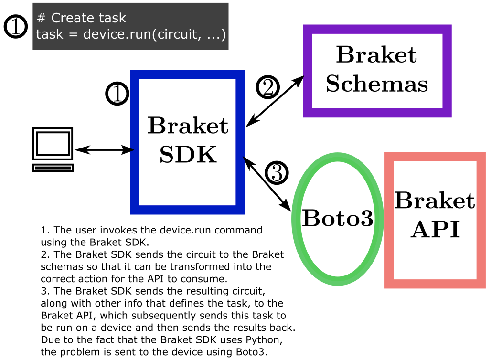

#################################################
Getting Started with the Amazon Braket Python SDK
#################################################

It is easy to get started with Amazon Braket Python SDK. You can get
started using an Amazon Braket notebook instance or using
your own environment.

For more information about Amazon Braket, see the full set of documentation
at https://docs.aws.amazon.com/braket/index.html.

.. toctree::
    :maxdepth: 2

************************************************
Getting started using an Amazon Braket notebook
************************************************

You can use the AWS Console to enable Amazon Braket, 
then create an Amazon Braket notebook instance
and run your first circuit with the Amazon Braket Python SDK:

1. `Enable Amazon Braket <https://docs.aws.amazon.com/braket/latest/developerguide/braket-enable-overview.html>`_.
2. `Create an Amazon Braket notebook instance <https://docs.aws.amazon.com/braket/latest/developerguide/braket-get-started-create-notebook.html>`_.
3. `Run your first circuit using the Amazon Braket Python SDK <https://docs.aws.amazon.com/braket/latest/developerguide/braket-get-started-run-circuit.html>`_.

When you use an Amazon Braket notebook, the Amazon Braket SDK and plugins are
preloaded. 

***********************************
Getting started in your environment
***********************************

You can install the Amazon Braket Python SDK in your environment
after enabling Amazon Braket and configuring the AWS SDK for Python:

1. `Enable Amazon Braket <https://docs.aws.amazon.com/braket/latest/developerguide/braket-enable-overview.html>`_.
2. Configure the AWS SDK for Python (Boto3) using the `Quickstart <https://boto3.amazonaws.com/v1/documentation/api/latest/guide/quickstart.html>`_.
3. `Run your first circuit using the Amazon Braket Python SDK <https://docs.aws.amazon.com/braket/latest/developerguide/braket-get-started-run-circuit.html>`_.
   
***********************************
Troubleshooting
***********************************

When the user submits a task to be run on the QPU’s or simulators with the AWS SDK for Python, there are two supporting features that enable this task to be run on a device and allow the results to be returned to the user. After the task is submitted, the task is first sent to the Braket schemas. The schemas transform the circuit construct that is being submitted using Python into the correct action for the API to consume.

Once the schemas transform the circuit into the correct format, the circuit is sent back to the SDK and is then sent to the API that interfaces the tasks submitted by Braket to the device of interest. Various information is sent to the API along with the circuit that has been translated by the schemas, including the address of the S3 bucket, the number of qubits, etc. The API then decides if all of the information sent to it coherently describes a problem and if there are issues with how the task is submitted, the API will return an error. If there are no issues, the information that defines the problem (including the circuit) is sent to run on the device of interest. Due to the fact that Braket constructs circuits with Python, the problem is sent to the appropriate device using Boto3. The results are then transferred through the API back to the user.

A map of this process can be seen in the diagram below:

